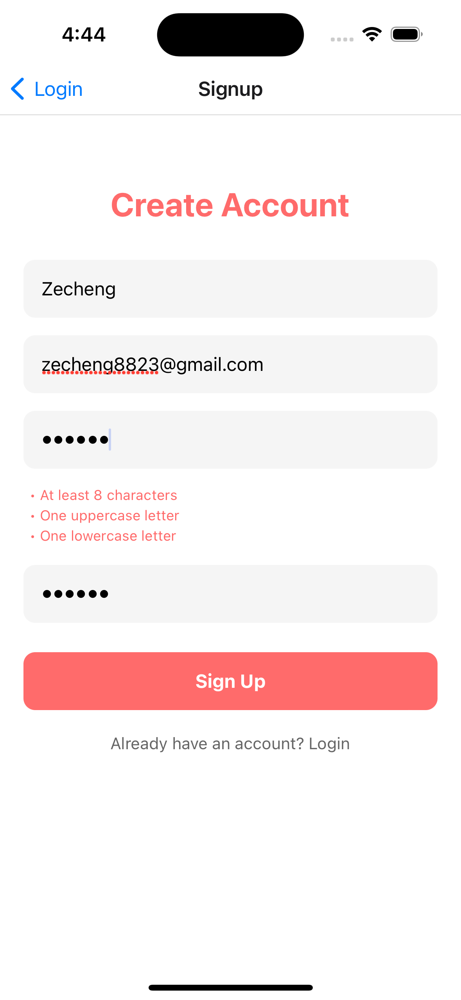
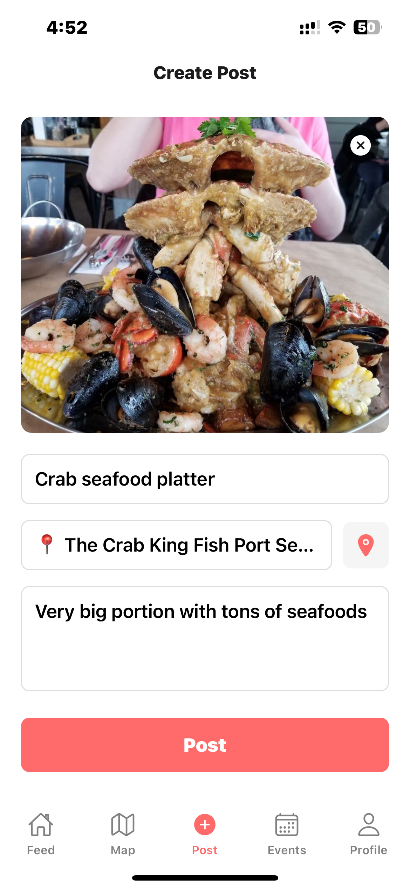

# Tasteful Tales
**Group 14**
**Jiale Zhang, Zecheng Zhou**


## App Store Description

Discover and share your culinary adventures with Tasteful Tales - your personal food diary and social companion. Create beautiful food memories by capturing dishes, sharing recipes, and exploring local dining spots. Connect with fellow food enthusiasts, discover hidden gems on our interactive food map, and build your own digital cookbook.

Whether you're a home chef experimenting with new recipes or a food explorer hunting for your next favorite restaurant, Tasteful Tales helps you document and share your gastronomic journey. Take photos of your creations, mark your favorite spots on the map, and set reminders for upcoming food events or restaurant openings.

Key Features:
• Create and share food stories with photos, recipes, and location tags
• Explore an interactive map showing nearby restaurants and food recommendations
• Schedule reminders for food events, restaurant openings, or cooking plans
• browse the posts of other food enthusiasts and discover their culinary adventures


### Slogan
"Every meal tells a story - Share yours with Tasteful Tales"

### DEMO Video
https://www.youtube.com/watch?v=WJVjb9Je0JA&t=45s

### API Keys Required
1. **Google Places API**
   - Create a project in Google Cloud Console
   - Enable Places API
   - Generate API key
   - Add to `.env` as `EXPO_PUBLIC_GOOGLE_PLACES_API_KEY`

2. **OpenWeather API**
   - Register at OpenWeather
   - Generate API key
   - Add to `.env` as `EXPO_PUBLIC_WEATHER_API_KEY`

### Configuration
#### SDK: Expo 51
#### Create a `.env` file in the root directory with the following environment variables:
- EXPO_PUBLIC_API_apiKey;
- EXPO_PUBLIC_API_authDomain;
- EXPO_PUBLIC_API_projectId;
- EXPO_PUBLIC_API_storageBucket;
- EXPO_PUBLIC_API_messagingSenderId;
- EXPO_PUBLIC_API_appId;
- EXPO_PUBLIC_GOOGLE_PLACES_API_KEY;
- EXPO_PUBLIC_WEATHER_API_KEY;

## Current Implementation Status

### Completed Features

- Main Feed with Post Display
- Create New Posts with Images and Restaurant Location
- Create New Events
- Event Calendar View
- Map Integration with Restaurant Search
- Basic Profile Management

### Iteration 2 and 3 Updates

#### New Functionalities

1. **Location Services** ✅
   - Real-time location tracking
   - Reverse geocoding for address lookup
   - Restaurant proximity search
   - Map-based restaurant selection

2. **External API Integration** ✅
   - Google Places API
     - Nearby restaurant search
     - Restaurant details and ratings
     - Geographical coordinates
   - OpenWeather API
     - Current weather conditions
     - Temperature data
     - Location-based weather updates

3. **Camera/Gallery Integration** ✅
     - Photo capture from camera
     - Image selection from gallery
     - Image preview and management
     - Upload functionality

4. **Authentication** ✅
    - Firebase Authentication integrated
    - Access control
    - Login and signup interface
    - Password reset through Email

5. **Notifications** ✅
   - Event reminder set automatically
   - Notify user when event approches

6. **Post Search** ✅
  - Search posts by title
  - Sort posts by date

### Implementation Progress

✅ Completed in Iteration 3:
- Photo capture from camera
- Image selection from gallery
- Location services
- External API integration
- Map interface
- Weather integration
- Restaurant search and selection
- Feed posts search and display
- Signup and Login interface
- User Authentication
- Notification system
- Camera/Gallery functionality
- Post search by its title

🔄 In Progress:
- None


### Team Member Contributions

#### Jiale Zhang

-  **Core Features:**
  - Implemented main feed functionality
  - Developed post creation system
  - Integrated map functionality with Google Places API
  - Implemented weather service with OpenWeather API
  - Developed location-based services

- **Technical Implementations:**
  - External API integrations:
    - Google Places API for restaurant search
    - OpenWeather API for weather data
  - Location services:
    - Real-time tracking
    - Reverse geocoding
    - Restaurant proximity search
  - Navigation system:
    - Screen navigation
    - Data passing between screens
    - Parameter handling


#### Zecheng Zhou
- Implemented main event functionality
- Created the firestore database
- Created the firebase image storage
- Developed the profile features
- **Technical Implementations:**
  - Firebase integrations:
    - Firestore database management
    - Cloud storage for images
    - Security rules implementation
  - Authentication system
    - Signup and Login
    - Password vaildation and reset
    - Persistent login and user logout
  - Real-time data synchronization
    - listening to database changes
    - updating UI based on database changes
  
## UI Sketches

1. Main Page Feed(Jiale Zhang):
    - Top: Header
    - Middle: Scrollable photo card stream
    - Bottom: Navigation bar (Feed, Map, Post, Events, Profile)
2. Map Page(Jiale Zhang):
    - **Read:**
      - Users can view nearby restaurants on the map
      - Users can see restaurant details including name, rating, and open status
    - **Create:**
      - Users can select a restaurant to create a new post
      - Integration with Google Places API for restaurant data
    - 
3. Post Page(Jiale Zhang):
    - Camera viewfinder/photo preview
    - Location selector
    - Text description input box
4. Events Page (Zecheng Zhou):
    - List view of Events
    - Add event function
    - Edit event function
    - Event list display
5. Profile Page (Zecheng Zhou):
    - Personal profile
    - Account information
    - updating profile info
6. Guest Page (Zecheng Zhou):
    - display current posts
    - Enhance user engagement


**CRUD operations for each page:**

### **1. Guest Page**
- **Read:**
  - Users can view the current posts without signing up or logging in
  - 

### **2. Signup and Login Page**
- **Create:**
  - Users can create new accounts with email and password
  - Password validation with strength requirements
  - 
- **Read:**
  - Users can log in with existing credentials
  - Password reset functionality available
  - 

### **3. Main Page (Feed)**

- **Read:**
    - Users can browse the feed to see food stories shared by themselves and others.
    - Users can view details of posts, including photos, title, locations.
    - 


### **4. Map Page**

- **Read:**
  - Users can view nearby restaurants on the map
  - Users can see restaurant details including name, rating, and open status
  - Users can re-search restaurants by dragging the map
- **Create:**
  - Users can select a restaurant to create a new post
  - Integration with Google Places API for restaurant data
- 


### **5. Post Page**

- **Create:**
  - Users can create new food posts by:
    - Uploading photos from camera or gallery
    - Adding title and descriptions
    - Selecting restaurant location from map
    - Getting current location with weather information
  - Restaurant information is automatically formatted when selected from map
- 
- 

### **6. Events Page**
- **Create:**
    - Users can create new events, such as food festivals, restaurant openings, or cooking plans. Title, Location, Description and Schedule can be added to the events.
    - An notification reminder will be created along side the creation of the event. Notification will be made when the event time that users set approches.
    -  
- **Read:**
    - Users can browse upcoming events in list view, seeing details like dates, descriptions, and locations.
    - 
- **Update:**
    - Users can edit their events changing dates, descriptions, title or location, the update will be made based on the original information of the event.
    - 
- **Delete:**
    - Users can delete their events, removing them from their event list, with an alert of comfirmation.
    - 

### **7. Profile Page**
- **Read:**
    - Users can view their own profile, including their profile photo, account infomation and their post images.
    - 
- **Update:**
    - Users can edit their profiles, updating details like their name, email, bio and profile photo.
    -   
    

## data model

1. Users Collection

```
CRUD operations: Create, Read, Update
users/{userId}
- email: string
- displayName: string
- bio: string
- profileImage: string
- postsCount: int
- eventsCount: int
```

2. Posts Collection

```
CRUD operations: Create, Read
posts/{postId}
- owner: string
- image: String
- title: string
- location: string
- description: string
- createdDate: timestamp

```

3. Events Collection

```
CRUD operations: Create, Read, Update, Delete
events/{eventId}
- owner: string
- title: string
- description: string
- date: timestamp
- location: string

```