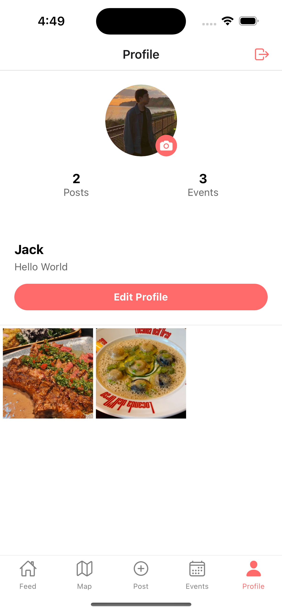

# Tasteful Tales
**Group 14**
**Jiale Zhang, Zecheng Zhou**


## App Store Description

Discover and share your culinary adventures with Tasteful Tales - your personal food diary and social companion. Create beautiful food memories by capturing dishes, sharing recipes, and exploring local dining spots. Connect with fellow food enthusiasts, discover hidden gems on our interactive food map, and build your own digital cookbook.

Whether you're a home chef experimenting with new recipes or a food explorer hunting for your next favorite restaurant, Tasteful Tales helps you document and share your gastronomic journey. Take photos of your creations, mark your favorite spots on the map, and set reminders for upcoming food events or restaurant openings.

Key Features:
• Create and share food stories with photos, recipes, and location tags
• Explore an interactive map showing nearby restaurants and food recommendations
• Schedule reminders for food events, restaurant openings, or cooking plans
• browse the posts of other food enthusiasts and discover their culinary adventures

## Slogan

"Every meal tells a story - Share yours with Tasteful Tales"

## Current Implementation Status

### Completed Features

- Main Feed with Post Display
- Create New Posts with Images
- Create New Events
- Event Calendar View
- Map Integration
- Basic Profile Management

### Team Member Contributions

#### Jiale Zhang

- Implemented main feed functionality
- Developed post creation system
- Integrated basic map feature
- Implemented image upload functionality
- Implemented navigation bar
- Implemented crud operations for corresponding screens

#### Zecheng Zhou
- Implemented main event functionality
- Integrated the firestore database
- Integrated the firebase image storage
- Developed the profile features

## UI Sketches

1. Main Page Feed(Jiale Zhang):
    - Top: Header
    - Middle: Scrollable photo card stream
    - Bottom: Navigation bar (Feed, Map, Post, Events, Profile)
2. Map Page(Jiale Zhang):
    - will be implemented in iteration 2
3. Post Page(Jiale Zhang):
    - Camera viewfinder/photo preview
    - Location selector
    - Text description input box
4. Events Page (Zecheng Zhou):
    - List view of Events
    - Add event function
    - Edit event function
    - Event list display
5. Profile Page (Zecheng Zhou):
    - Personal profile
    - Account information
    - updating profile info
    


**CRUD operations for each page:**

### **1. Main Page (Feed)**

- **Read:**
    - Users can browse the feed to see food stories shared by themselves and others.
    - Users can view details of posts, including photos, title, locations.
    - 


### **2. Map Page**

- will be implemented in iteration 2
- 

### **3. Post Page**

- **Create:**
    - Users can create new food posts by uploading photos, adding descriptions, and selecting the location of the meal.
    - 

### **4. Events Page**
- **Create:**
    - Users can create new events, such as food festivals, restaurant openings, or cooking plans. Title, Location, Description and Schedule can be added to the events.
    - 
- **Read:**
    - Users can browse upcoming events in list view, seeing details like dates, descriptions, and locations.
    - 
- **Update:**
    - Users can edit their events changing dates, descriptions, title or location, the update will be made based on the original information of the event.
    - 
- **Delete:**
    - Users can delete their events, removing them from their event list, with an alert of comfirmation.
    - 

### **5. Profile Page**
- **Read:**
    - Users can view their own profile, including their profile photo, account infomation and their post images.
    - 
- **Update:**
    - Users can edit their profiles, updating details like their name, email, bio and profile photo.
    -   
    

## data model

1. Users Collection

```
CRUD operations: Create, Read, Update
users/{userId}
- email: string
- displayName: string
- bio: string
- profileImage: string
- postsCount: int
- followersCount: int
- followingCount: int

```

2. Posts Collection

```
CRUD operations: Create, Read
posts/{postId}
- owner: string
- image: String
- title: string
- location: string
- description: string
- createdDate: timestamp

```

3. Events Collection

```
CRUD operations: Create, Read, Update, Delete
events/{eventId}
- owner: string
- title: string
- description: string
- date: timestamp
- location: string

```